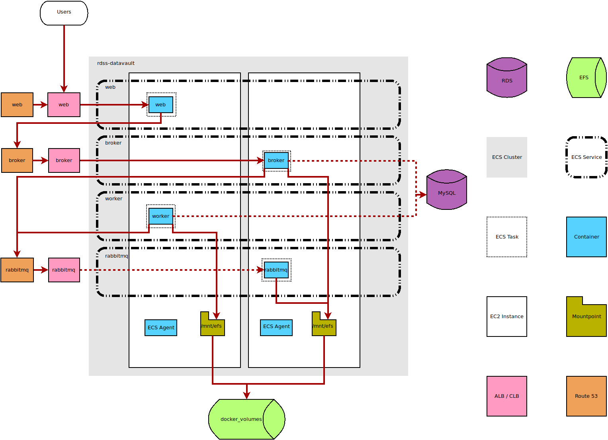

# Deployment with Terraform + Amazon ECS

- [Requirements](#requirements)
- [Check out the code](#check-out-the-code)
- [Bootstrap](#bootstrap)

## Requirements

You need [Terraform](https://www.terraform.io) and [AWS CLI](https://aws.amazon.com/cli/) installed locally.

## Bootstrap

Start setting up AWS CLI with your credentials an the preferrred region. Run the following command to introduce the preferred region, secret key, etc.:

    aws configure

Initialise terraform:

    terraform init

## Usage

Generate an execution plan for Terraform:

    terraform plan

Apply the changes:

    terraform apply

## Configuration

At present, there is a small amount of configuration that has to occur after the system starts.
Eventually, this should be removed, but until then this can be carried out by running the `./configure-storage.sh` script.
This currently has to be run every time the broker is started (as the broker tears down and resets the database).

## Credentials

Terraform will use the credentials set in your `~/.aws/credentials` file (set by the `aws configure` command above).
If you wish, you can also supply them with a variable in any of the ways Terraform supports:

* Passing `-var aws_secret_key=foo` on the command line
* Setting environment variable `TF_VAR_aws_secret_key=foo`
* Placing `aws_secret_key="foo"` in `terraform.tfvars` or another variable file

Some users will not normally have permissions to carry out the necessary commands, but can do it by assuming a role, e.g. `RdssDatavault` (creating such a role is outside the scope of this project).
To do so, place the following in your `~/.aws/config` file:

    [profile RdssDatavault]
    role_arn = arn:aws:iam::400079346860:role/RdssDatavault
    source_profile = default

Then, use the `profile` variable to tell Terraform to use the named profile, e.g. `terraform apply -var aws_profile=RdssDatavault`.

For more information, see:

* https://www.terraform.io/docs/configuration/variables.html
* https://docs.aws.amazon.com/cli/latest/userguide/cli-roles.html

## Keys

The VMs are loaded with a key-pair that can be used to allow SSH access to the user *ec2-user*.
The public key is stored in this repo, but you'll need to obtain the private key from another developer.

## Architecture

DataVault is deployed on AWS using AWS *Elastic Container Service* (ECS).
This is a tool for deploying Docker containers without concern for the physical machine they are located on, and integrates logging, service restarting, scaling etc.
We have (currently) one *ECS cluster*, rdss-datavault.

This cluster is made up of *EC2* instances (The eu-west-2 region does not support the use of Fargate).
These instances are created and managed by an *EC2 Auto Scaling Group*, which defines the desired number of instances, and the configuration each instance is launched with.
When an instance is created, a launch script is executed which connects it to the ECS cluster.
At present, the group has two instances, and can only be scaled manually; no automatic scaling has been configured.

Each of the four component parts of DataVault is defined as an *ECS task* which contains the relevant container, and each has a related *ECS service*.
ECS ensures that there is always one task running for each service (if a tasks exits, it will be restarted), by deploying it to one of the instances in the cluster.

For communication between containers, and with the outside world, each service is associated with a *Load Balancer*, either an *Application Load Balancer* or a *Classic Load Balancer* as appropriate.
Each Load Balancer has an associated *Route 53* entry, essentially a DNS name.
When one container (e.g web) needs to communicate with another (e.g. broker), it uses this DNS name.
The names are not resolveable externally.

There is a MySQL database created using *RDS*, which the broker and workers communicate with.

There is an *Elastic File System* (EFS), similar to a NFS-server.
This is mounted onto each of the EC2 instances.
Folders within this mount-point are then linked as volumes in relevant ECS task definitions, and bound to the appropriate location in each container.
Currently, there are volumes for persisting RabbitMQ data, and for sharing /tmp/datavault between the broker and workers.

Container logs are written to *CloudWatch*.
There is one CloudWatch group, datavault, and then one log stream is created for each task that executes.

There is a *security group* which defines who is able to access the EC2 instances and on what ports.
There are also additional security groups to control communication between the instances and RDS/EFS.

There are two *S3* buckets, one to hold the Terraform state (see below), and the other to hold archived data.

There are three *Elastic Container Registry* (ECR) repositories.
These store the three DataVault-specific Docker images (which are build and pushed from the top-level Makefile).

Finally, there are also a number of *IAM* roles and policies in place to allow different components to take actions.

Diagram (simplified): 

## Accessing the application

Once it is running, the application can be accessed through the URL of the web load-balancer.
This is currently http://rdss-datavault-web-lb-787974648.eu-west-1.elb.amazonaws.com/datavault-webapp/auth/login . 
If the load-balancer is destroyed, this will change.
You'll be able to find the new value through the AWS Console, under EC2 > Load Balancers > rdss-datavault-web-lb > DNS Name.

This is only a temporary approach - we don't have an externally-accessible DNS zone, so the associated Route 53 entry for this load-balancer isn't any use.
We've instead made the load-balancer externally available.
Once this has been migrated to the main RDSS AWS account, we'll be able to remove this workaround.

## State

The terraform state is stored within an S3 bucket, configured in `backend.tf`.
This bucket is defined in `s3.tf`, but there's a chicken-and-egg problem here - Terraform needs the bucket to exist before it can do anything, including creating the bucket.
If the bucket is ever deleted, or you want to move to a different bucket, you'll need to create the bucket some other way, e.g. through the web interface.
The bucket is marked with `prevent_destroy = true`, so that it shouldn't be deleted, but you should always take care with it.
